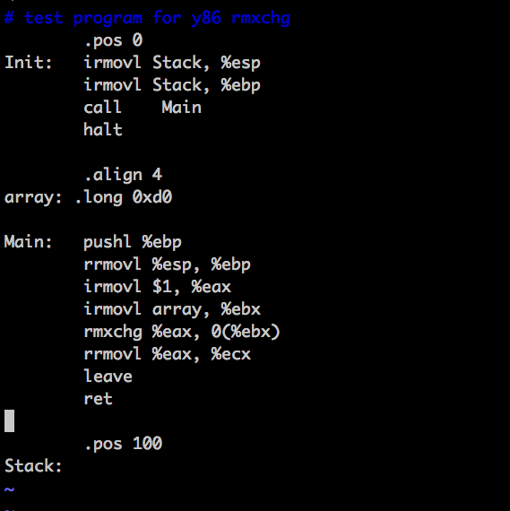
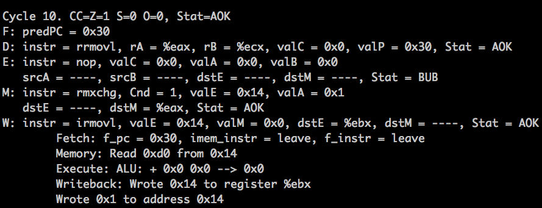

# archlab Part C文档
软件52班 张迁瑞 2015013226

partC部分，我实现了rmxchg，isubl,iandl,ixorl几条指令。

## rmxchg
交换寄存器与内存的值。

用法：rmxchg rA, D(rB)

### 修改过程
- 修改 sim/misc/yas-grammar.lex, 在Instr中加入rmxchg
- 修改 sim/misc/isa.h,  在itype\_t中加入I\_RMXCHG
- 修改 sim/misc/isa.c
	- 模仿其他指令，在 instruction_set[]集合中加入{"rmxchg", HPACK(I\_RMXCHG, F\_NONE), 6,  R\_ARG, 1, 1, M\_ARG, 1, 0}
	- 在 step_state函数下的need\_regids和need\_imm下加入hi0 == I\_RMXCHG,表明这个指令需要用到寄存器与立即数。
	- 在 step_state函数下的switch语句中加入case I\_RMXCHG的描述,主要参考mrmovl。

### seq rmxchg描述

rmxchg rA, D(rB)

fetch:

    icode:ifun <- M1[PC]
    rA:rB <- M1[PC + 1]
    valC <- M4[PC + 2] 
    valP <- PC + 6

decode:   

    valA <- R[rA] 
    valB <- R[rB]

 execute:

	valE <- valB + valC
 
 memory:

    valM <- M4[valE]
    M4[valE] <- valA

 write back:

    R[rA] <- valM

 PC update:

    PC <- valP

### pipeline
由于指令涉及内存的读取，可能会产生Load/Use Data Hazards,所以这条指令的数据冒险问题不能仅用转发来解决，需要使用加载互锁。这一点和mrmovl基本相同，故仿照其进行了添加。

测试用例如下：

使用rmxchg后马上使用更换后的值，证明了加载互锁的正确性，如下图：

最后的结果也证明了rmxchg的正确性。

## isubl,iandl,ixorl
这几条指令的实现基于之前处理器自带的opl系列函数，用法均与iaddl相同。

### 修改过程
- 修改 sim/misc/yas-grammar.lex, 在Instr中加入isubl,iandl,ixorl
- 修改 sim/misc/isa.h,  在itype\_t中加入I\_IOPL,删去原来的iaddl
- 修改 sim/misc/isa.c
    - 在 instruction_set[]集合中添加isubl,iandl,ixorl,并修改iaddl，使之符合类似addl，subl的形式
    - 在 step_state函数下的need\_regids和need\_imm下加入hi0 == I\_IOPL，删去原有的IADDL
    - 在 step_state函数下的switch语句中加入case I\_IOPL的描述，删去原来的I\_IADDL,I\_IOPL其他部分和I\_IADDL类似，但求值部分使用了原来的ALU函数`val = compute_alu(lo0, argA, argB);`

### seq描述

iopl **V** **rb**

fetch:

    icode:ifun <- M1[PC]
    rA:rB <- M1[PC+ 1]
    valC <- M4[PC + 2]
    valP <- PC + 6  

 decode:

    valB <- R[rb]

 execute:

    valE <- valB op valC
    set CC

 memory:
 write back:

    R[rb] <- valE

 PC update:

    PC <- valP

### pipeline
没有特别的注意事项。
### 测试
因为这次修改实质上是将原来的iaddl融入了新的体系中，而isubl,iandl,ixorl只是使用了不同的alu函数，故重新运行了附带的对于iaddl的测试。成功之后，分别对isubl,iandl,ixorl写了三个简短的测试用例，均测试成功。（感觉理论上iaddl成功了这些肯定没有问题，不过为了作业要求还是都写了意思一下...)

